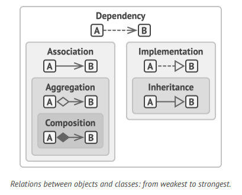

# Introduction To OOP

Pemrograman Berorientasi Objek (Object-Oriented Programming atau disingkat OOP) adalah paradigma pemrograman yang berfokus pada penggunaan objek-objek sebagai unit utama untuk merancang dan mengembangkan perangkat lunak. Paradigma ini memungkinkan pengorganisasian kode yang lebih terstruktur dan modular dengan cara menggabungkan data (atribut) dan fungsi (metode) ke dalam objek-objek yang mewakili entitas-entitas dalam dunia nyata. </br>

## Basic Of OOP

Object Oriented programming adalah sebuah paradigma yang didasarkan dengan konsep membungkus potongan-potongan data, dan perilaku yang terkait dengan datanya
ke dalam sebuah unit yang disebut `object`, yang dibangun dari sekumpulan `blueprint` yang disebut `class` oleh programmer.

### Object, Class

- Apakah kalian suka kucing? Kucing adalah sebuah `object`, dan kucing juga adalah sebuah `class`.</br>
  Kucing adalah sebuah `object` karena kucing memiliki atribut-atribut seperti `nama, warna, dan lain-lain`. </br>
  Kucing juga adalah sebuah `class` karena kucing adalah sebuah `blueprint` yang digunakan untuk membuat `object` kucing.
  Dalam `OOP`, object adalah sebuah instance dari sebuah `class`. Sebuah `class` dapat memiliki banyak object, dan setiap object memiliki atribut-atribut yang berbeda-beda.</br>
  Sebagai contoh, kucing memiliki atribut `nama, warna, dan lain-lain`. </br>
  Kucing yang berwarna hitam, dan kucing yang berwarna putih adalah dua object yang berbeda, namun keduanya adalah object dari class kucing.

  |   kucing   |        Kucing        |
  | :--------: | :------------------: |
  |   Field    |        Method        |
  |  (+) Name  |     (+) Breath()     |
  | (+) Gender |    (+) Eat(food)     |
  |  (+) Age   |   (+) Sleep(hours)   |
  | (+) Color  | (+) Run(destination) |

  Katakanlan kita memiliki seekor kucing bernama `kitten`, `kitten` disini adalah sebuah object dari class `Kucing`. </br>
  Setiap kucing memiliki attribute standar seperti `nama, warna, dan lain-lain`. </br>
  Setiap kucing juga memiliki method atau perilaku standar seperti `breath, eat, sleep, dan lain-lain`. </br>
  Secara kolektif, attribute dan method dari sebuah class disebut sebagai `field` dan `method`. </br>
  Contoh:

  | John as Kucing | Lucy as Kucing  |
  | :------------: | :-------------: |
  |  name = john   |   name = lucy   |
  | gender = male  | gender = female |
  |    age = 2     |     age = 1     |
  | color = black  |  color = white  |

  Bisa kita lihat bahwa `john` dan `lucy` adalah dua object yang berbeda, namun keduanya adalah object dari class `Kucing`. </br>
  Perbedaan antara `john` dan `lucy` adalah pada atribut-atributnya, `john` memiliki atribut `name = john`, sedangkan `lucy` memiliki atribut `name = lucy`. </br>
  Jadi, `class` adalah sebuah `blueprint` yang digunakan untuk membuat `object`. </br>

### Class hierarchies

- Semuanya terlihat baik-baik saja ketika memiliki 1 `class`, tetapi real program memiliki lebih dari 1 `class`.</br>
  Beberapa dari `class` ini mungkin di organisir dalam sebuah `hierarchy` atau `tree`. </br>
  Sebagai contoh, kita memiliki `class` `Kucing`, `Anjing`. </br>
  Ketiga `class` ini adalah `subclass` dari `class` `Hewan`. </br>
  Karena `Kucing`, `Anjing` adalah `subclass` dari `class` `Hewan`, maka `Kucing`, `Anjing` akan memiliki atribut dan method yang memiliki banyak kesamaan. </br>
  Sebagai `parent class`, seperti yang baru saja kita definisikan, maka `Hewan` bisa disebut dengan `superclass` dari `subclass` `Kucing`, `Anjing`. </br>
  Karena `subclass` mewarisi status dan perilaku dari `superclass`, maka hanya mendefinisikan atribut dan method yang berbeda dari `superclass` saja. </br>
  Contohnya seperti di `class` `Kucing` akan memiliki method `meow()`, sedangkan `class` `Anjing` akan memiliki method `bark()`. </br>

  |   Animal   |        Animal        |
  | :--------: | :------------------: |
  |   Field    |        Method        |
  |  (+) Name  |     (+) Breath()     |
  | (+) Gender |    (+) Eat(food)     |
  |  (+) Age   |   (+) Sleep(hours)   |
  | (+) Color  | (+) Run(destination) |

  |      Kucing       |        Anjing        |
  | :---------------: | :------------------: |
  |       Field       |        Field         |
  | (-) isNasty: bool | (+)bestFriend: Human |
  |      Method       |        Method        |
  |    (+) Meow()     |      (+) Bark()      |

  Dalam contoh diatas, kita bisa melihat bahwa `class` `Kucing` dan `Anjing` adalah `subclass` dari `class` `Animal`. </br>
  Dalam Asumsi diatas kita memiliki persyaratan bisnis terkait, kita dapat melangkah lebih jauh dan mengekstrak `class` jauh lebih umum lagi. </br>
  Seperti dalam organisasi Makhluk Hidup yang akan menjadi `superclass` dari `class` `Animal` dan `class` `Plant`. </br>
  Contoh seperti itu disebut dengan `class hierarchies` atau `class tree`. </br>

  ```
  - Makhluk Hidup (Superclass)
      - Animal (Subclass)
          - Kucing (Subclass)
          - Anjing (Subclass)
      - Plant (Subclass)
          - Pohon (Subclass)
          - Rumput (Subclass)
  ```

  Subclass dapat mengganti atau menambahkan perilaku dari superclass. Subclass dapat sepenuhnya mengganti perilaku default dari superclass, atau subclass dapat menambahkan perilaku baru ke superclass. </br>

## Pillars of OOP

Pilar Dasar dari OOP adalah:

### Abstraction

- Sebagian besar waktu ketika kamu membuat program dengan `OOP`, kamu membuat object berdasarkan object dunia nyata </br>
  Namun, kamu tidak perlu membuat object yang sama persis dengan object dunia nyata. </br>
  Tetapi, kamu hanya perlu membuat object yang memiliki atribut dan method yang nyata dalam konteks program yang kamu buat. </br>
  Sebagai contoh, sebuah class `pesawat` mungkin bisa ada di keduanya seperti `flight simulator` dan `flight booking app`. </br>
  Tetapi dalam konteks `flight simulator`, kamu hanya perlu membuat atribut dan method yang berkaitan dengan `flight simulator` saja. </br>
  Sedangkan dalam konteks `flight booking app`, kamu hanya mempedulikan tentang kursi dan peta yang mana kursi yang tersedia dan yang tidak. </br>

  |    Pesawat     |      Pesawat       |
  | :------------: | :----------------: |
  |     Field      |       Field        |
  |   (-) speed    |     (-) seats      |
  |  (-) altitude  |                    |
  | (-) rollAngle  |                    |
  | (-) pitchAngle |                    |
  |  (-) yawAngle  |                    |
  |     Method     |       Method       |
  |    (+)fly()    | (+) reserveSeats() |

  Abstraction adalah sebuah model dari object dunia nyata yang hanya menampilkan atribut dan method yang relevan dengan konteks program yang kamu buat. </br>

### Encapsulation

- Untuk menjalankan sebuah mobil, kamu hanya membutuhkan untuk menekan sebuah tombol.
  Kamu tidak perlu menyambungkan kabel dibawah mesih dll untuk memulai siklus tenaga mesin.
  Detail seperti itu disembunyikan dari kamu, dan kamu hanya perlu menekan sebuah tombol.
  Kamu hanya memiliki interface yang sederhana untuk mengoperasikan mobil.
  Ini menggambarkan bagaimana setiap object yang memiliki interface public dari suatu object, terbuka untuk interaksi dengan object lain.
- Encapsulation adalah kemampuan sebuah object untuk menyembunyikan bagian state dan perilaku dari object lain, dia hanya mengekspose limit interface ke seluruh program </br>
- Mengenkapsulasi sebuah object berarti menjadikannya `private` dan hanya bisa diakses oleh method yang ada di dalam class tersebut.
  Ada method yang lebih sedikit untuk membatasi yang disebut `protected` yang membuat anggota dari sebuah `class` hanya bisa diakses oleh `subclass` tersebut. </br>
- Interface dan abtrak class dari sebagian besar bahasa pemrograman didasarkan pada konsep `encapsulation` dan `abstraction`.
  Dalam `OOP` modern, mekanisme interface (biasanya dideclare dengan kata kunci interface atau protokol) yang mendefinisikan kontrak interaksi antara object.
  Itulah salah satu alasan mengapa interface hanya peduli dengan perilku object, dan mengapa kamu tidak dapat mendeklarasikan field di dalam interface. </br>
- Bayangkan kamu memiliki interface `FlyingTransport` dengan sebuah method `fly(origin, destination, passengers)`.
  Ketika mendesain `air transportaion simulator`, kamu dapat membatasi class `airport` untuk hanya dengan object yang mengimplementasikan interface `FlyingTransport`.
  Setelah itu, kamu dapat yakin bahwa object apapun yang dioperasikan oleh `airport`, apakah itu `airplane, helicopter, atau DomesticatedGryphon` yang aneh akan memiliki method `fly(origin, destination, passengers)`. </br>

- Contoh:

  |     Class Name      |                    Description                     |
  | :-----------------: | :------------------------------------------------: |
  |       Airport       |        (+) accept(vehicle: FlyingTransport)        |
  |   FlyingTransport   | fly(origin, destination, passengers) --> Interface |
  |     Helicopter      |      (+) fly(origin, destination, passengers)      |
  |      Airplane       |      (+) fly(origin, destination, passengers)      |
  | DomesticatedGryphon |      (+) fly(origin, destination, passengers)      |

  Kamu dapat mengubah implementasi method `fly` di class dengan cara apapun yang kamu inginkan, tetapi kamu tidak dapat mengubah signature method `fly` di interface `FlyingTransport`. </br>

### Inheritance

- Inheritance adalah kemampuan untuk membangun sebuah class dari class yang sudah ada. Manfaat utama dari inheritance adalah reusability.
  Jika kamu ingin membuat sebuah class yang sedikit berbeda dari class yang sudah ada, kamu dapat mewarisi class yang sudah ada dan menambahkan atribut dan method yang kamu butuhkan. </br>
- Konsekuensi dari penggunaan inheritance adalah subclass memiliki interface yang sama dengan superclass. Kamu tidak bisa menyembunyikan method yang sudah ada di superclass.
  Kamu hanya bisa menambahkan method baru di subclass. Kamu juga harus mengimplementasikan semua method abstract, meskipun method tersebut tidak relevan dengan subclass. </br>
- Contoh:
  - Animal (superclass)
    - Cat (inheritance from Animal)
      - FourLegged (inheritance from Cat)
        - (+)run(destination)
      - OxygenBreather (inheritance from Cat)
        - (+)breath()
- Kebanyakan dari bahasa pemrograman, sebuah subclass hanya dapat extend dari satu superclass.
  Di sisi lain, setiap class dapat mengimplementasikan beberapa interface secara bersamaan.
  Tetapi seperti yang disebutkan sebelumnya, jika superclass mengimplementasikan sebuah interface, maka subclass juga akan mengimplementasikan interface tersebut. </br>

### Polymorphism

- Mari kita lihat beberapa contoh `Hewan`. sebagian besar `Hewan` dapat mengeluarkan suara. Kita bisa mengantisipasi bahwa semua subclass perlu override method `makeSound()`.
  Sehingga setiap subclass dapat mengeluarkan suara yang benar. Oleh karena itu, kita dapat mendeklarasikan secara `Abstract` langsung.
  Hal ini memungkinkan kita untuk menghilangkan implementasi default dari method di superclass, tetapi memaksa semua subclass untuk membuat dengan method sendiri. </br>
- Contoh :

  | Class Name |             Description             |
  | :--------: | :---------------------------------: |
  |   Animal   | (+) makeSound() --> Abstract Method |
  |    Cat     | (+) makeSound() --> Override Method |
  |    Dog     | (+) makeSound() --> Override Method |

- Bayangkan kita memasukkan beberapa `cat` dan `dog` kedalam sebuat tas besar. Kemudian, dengan mata tertutup, kita mengeluarkan hewan-hewan itu satu per satu dari dalam tas.
  Setelah mengeluarkan seekor hewan dari dalam tas, kita tidak tahu pasti hewan apa itu.
  Namun, ketika kita memeluknya dengan keras, hewan itu mengeluarkan suara. Dari suara itu, kita dapat mengidentifikasi hewan itu adalah `cat` atau `dog`.
- Program tidak mengetahui hewan apa yang akan keluar dari tas, tetapi berkat mekanisme khusus yang disebut `polymorphism`,
  program dapat memanggil method `makeSound()` tanpa mengetahui tipe hewan apa yang akan keluar dari tas. </br>
- Polymorphism adalah kemampuan sebuah program untuk mendeteksi class dari sebuah object dan memanggil implementasinya bahkan ketika tipe object tidak diketahui
  pada saat kompilasi. </br>
- Kamu juga dapat menganggap `polymorphism` sebagai kemampuan object untuk berpura-pura menjadi sesuatu yang lain.
  Biasanya class yang diperluas atau interface yang diimplementasikan.
  Dalam contoh diatas, object `cat` berpura-pura menjadi `Animal` ketika kamu memanggil method `makeSound()`. </br>

## Relationship Between Objects

Selain inheritance, ada beberapa jenis relasi antara object lainnya. </br>

### Dependency

`Professor -----> Course` </br>
UML dependency, Profesor depands kepada course, karena dia mengajar course tersebut. </br>

- Dependency adalah jenis relasi yang paling dasar dan paling lemah antar class.
  Ada dependency antara 2 class, jika ada beberapa perubahan pada definisi 1 class dapat mengakibatkan perubahan pada definisi class lainnya.
  Dependency biasanya terjadi ketika kamu menggunakan nama class yang konkrit dalam code kamu.
  Sebagai contoh, ketika menentukan tipe dalam signature method, ketika menginisialisasi object melalui constructor, dll.
  Kamu bisa membuat dependency menjadi lebih lemah, jika kamu membuat code kamu bergantung pada interface, bukan class konkrit. </br>
- Biasanya, UML diagram tidak menunjukkan semua depedency ada terlalu banyak depedency dalam real code.
  Alih-alih mengotori diagram dengan depedency, kamu harus sangat selektif dan hanya menunjukkan depedency yang penting. </br>

### Association

`Professor -----> Student` </br>
UML association, Professor komunikasi dengan student </br>

- Association adalah hubungan dimana 1 object digunakan atau berinteraksi dengan object lainnya.
  Dalam diagram UML, hubungan association ditunjukkan dengan panah sederhana yang ditunjukkan dari object dan menunjuk ke object yang digunakan.
  Ngomong-ngomong, memiliki association 2 arah adalah hal yang normal.
  Dalam kasus ini, panah memiliki titik di setiap ujungnya.
  Association dapat dilihat sebagai jenis depedency khusus, dimana object selalu memiliki akses ke object yang berinteraksi dengannya.
  Sedangkan depedency sederhana, tidak membuat hubungan permanen antara object. </br>
- Pada umumnya, kamu menggunakan association untuk merepresentasikan sebuah field yang berisi beberapa object lain.
  Field ini berfungsi sebagai penghubung antar 2 object.
  Tapi, tidak selalu harus berupa field. Association juga dapat direpresentasikan dengan method yang ngereturn beberapa object.
  Jika tidak, maka tidak mungkin menggunakan association antar interface(karena interface tidak memiliki field). </br>
- Untuk membuat pemahaman kamu tentang perbedaaan association dan depedency, mari kita lihat contoh berikut.
  ```cs
    public class Professor
    {
      private Student student;
      // ...
      public void Teach(Course c)
      {
          // ...
          this.student.Remember(c.GetKnowledge());
      }
    }
  ```
- Lihat method `Teach()`, dia memiliki parameter dari class `Course`, kemudian digunakan didalam body method.
  Jika seseorang mengubah signature method `GetKnowledge()` code kita akan rusak.
  Itulah mengapa kita bisa mengatakan bahwa class `Professor` memiliki depedency pada class `Course`.
- Sekarang, lihatlah field `student` dan bagaimana field tersebut digunakan dalam method.
  Kita dapat mengatakan dengan pasti bahwa class `Student` adalah sebuah depedency lain untuk `Professor`.
  Jika signature dari method berubah, maka code `Professor` akan rusak.
  Namun, karena field `student` selalu dapat diakses oleh method apapun dari class `Professor`, class `Student` bukan hanya sebuah depedency, tetapi juga sebuah association. </br>

### Aggregation

`Departement -----> Professor` </br>
UML aggregation, Departement berisi Professor </br>

- Aggregation adalah jenis association khusus yang mewakili `one-to-many`, `many-to-many`, atau `whole-part` antar beberapa object.
- Biasanya, Under aggregation, sebuah obejct memiliki kumpulan object lain dan berfungsi sebagai `container` or `collection`.
  Komponen dapat ada tanpa `container` dan dapat dihubungkan ke beberapa `container` pada saat bersamaan.
  Dalam UML, hubungan dengan aggregation ditunjukkan oleh garis dengan berlian kosong dibagian ujung `container` dan panah diujungnya yang mengarah ke komponen.
- Ketika berbicara mengenai relasi antar object, perlu diingat bahwa UML merepresentasikan relasi antar class.
  Ini artinya bahwa sebuah object `University` mungkin terdiri dari beberapa `Departement` bahkan meskipun kamu hanya memiliki 1 blok untuk setiap entity dalam diagram.
  Notasi UML dapat merepresentasikan jumlah dikedua sisi hubungan, tetapi tidak apa-apa untuk menghilangkannya jika jumlahnya jelas dari konteks. </br>

### Composition

`University -----> Departement` </br>
UML composition, University terdiri dari Departement </br>

- Composition adalah jenis aggregation tertentu, dimana 1 obejct terdiri dari 1 atau lebih object lainnya.
  Perbedaan antara relasi ini dengan yang lain adalah bahwa komponen hanya bisa ada sebagai dari `container`.
  Dalam UML, hubungan komposisi digambar sama dengan aggregation, tetapi dengan berlian yang terisi di ujung panah.
- Perhatikan, bahwa banyak orang sering menggunakan istilah `composition` apabila yang dimaksud adalah `Aggregation` dan `Composition`.
  Contoh yang paling terkenal untuk hal ini adalah prinsip yang terkenal `choose composition over inheritance.`
  Ini bukan karena orang-orang tidak tahu perbedaannyam, melainkan karena kata `composition` (contohnya, `object composition`) lebih umum digunakan daripada `aggregation`.

### Conclusion

Sekarang setelah mengetahui semua jenis hubungan antar object, mari kita lihat bagaimana mereka semua terhubung.
Semoga, ini akan membantu kamu untuk melalui pertanyaan-pertanyaan seperti
`apa perbedaan antara aggregation dan composition?` atau `Aoakah inheritance merupakan jenis depedency?`.

- <b>Depedency</b>: `Class A` dapat terpengaruh oleh perubahan pada `class B`.</br>
- <b>Association</b>: `Object A` tahu tentang `Object B`. `Class A` depands pada `class B`.</br>
- <b>Aggregation</b>: `Object A` tahu tentang `Object B`, terdiri dari `Object B`. `Class A` depands pada `class B`.
- <b>Composition</b>: `Object A` tahu tentang `Object B`, terdiri dari `Object B`, dan manage `Object B` lifecycle. `Class A` depands pada `class B`.
- <b>Implementation</b>: `Class A` mendefinisikan method yang dideklarasikan dalam `Interface B`. `Object A` dapat diperlakukan sebagai B. `Class A` depands pada `class B`.
- <b>Inheritance</b>: `Class A` mewarisi interface dan implementasi dari `Class B` tetapi bisa mengembangkannya.
  `Object A` dapat diperlakukan sebagai B. `Class A` depands pada `class B`.


